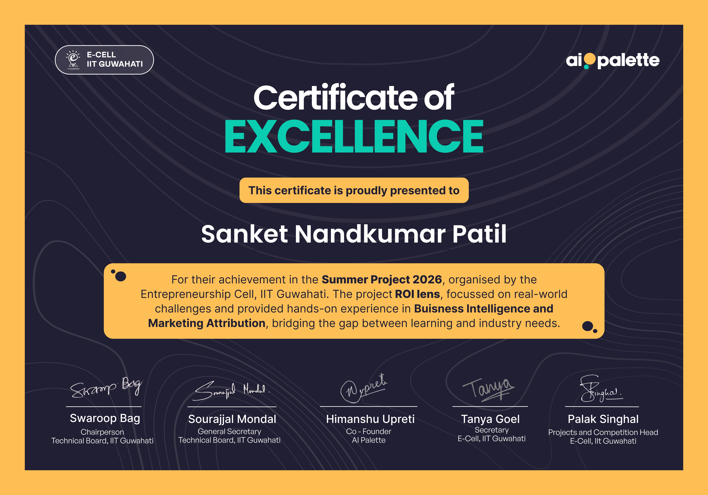

# ROI Lens: Enterprise Marketing Intelligence Platform


ROI Lens is a robust, FAANG-level AI platform for marketing attribution and budget optimization. It leverages advanced data science (Isolation Forests, Markov Chains, Shapley Game Theory, XGBoost) to transform messy omnichannel click streams into actionable financial intelligence.

## 🌟 The Business Problem
Modern digital marketers spend millions across Google, Instagram, TikTok, and Influencer networks. But when a customer clicks a TikTok ad, searches on Google, and finally converts via an email newsletter... **who gets the credit?**

Relying on basic "Last-Click" attribution ignores the entire customer journey, leading to wasted budget. Furthermore, synthetic bot traffic heavily skews marketing metrics.

**ROI Lens solves this by:**
1. Identifying and stripping fraudulent ad interactions using Unsupervised Machine Learning.
2. Distributing conversion credit mathematically using Time-Decay Markov Chains and Shapley Values.
3. Predicting future conversions and allocating the multi-million dollar budget sequentially to maximize Revenue (LTV).

---

## 🏗️ Architecture & ML Pipeline

The platform is built on a modular, microservice-style Python backend.

### 1. Advanced Mock Data Generator (`generator.py`)
Generates 15,000+ realistic customer journeys across Tier 1-3 cities, factoring in specific demographic personas (e.g., Gen Z, Deal Seekers) and their unique channel affinities and conversion probabilities.

### 2. Fraud Detection Engine (`bot_detection.py`)
Utilizes an **Isolation Forest (Unsupervised ML)** algorithm to identify non-human traffic. By calculating session entropy, average time gaps, and click-velocity, it effectively isolates and strips out bot traffic before it contaminates the attribution model.

### 3. Time-Decay Attribution (`attribution.py`)
- **Time-Decay Weighted Markov Chain**: Models the probability of a user transitioning between channels. Unlike standard Markov chains, it applies an exponential decay weight $e^{-\lambda t}$, giving heavier transition importance to touchpoints that occurred closer to the point of conversion.
- **Time-Decay Heuristic**: Distributes proportional credit directly to recent touches.

### 4. Predictive AI & Explainability (`prediction.py`)
An **XGBoost Classifier** predicts the likelihood of conversion based on session metadata. Crucially, the model utilizes **SHAP (SHapley Additive exPlanations)** to ensure full transparency, explaining to marketers exactly which features drive conversions.

### 5. Revenue Optimizer (`budget_allocator.py`)
An advanced algorithmic solver utilizing **Sequential Least SQuares Programming (SLSQP)**. It builds a non-linear Ad Fatigue saturation curve (`Revenue = A * (1 - e^{-k * Spend})`) for each channel and dynamically shifts a ₹100 Crore budget to predict the absolute maximum Revenue (LTV).

---

## 📊 Streamlit Business Intelligence Dashboard
The `app/main.py` script serves a highly polished, interactive BI Dashboard.
- **Executive Command Center:** View Budget Shifts vs Revenue Uplifts.
- **Bot & Fraud Detection:** Scatterplot clusters visualizing anomalous bots.
- **Customer Journeys (Sankey):** Beautiful flowcharts detailing exactly how traffic moves through different marketing channels before converting.
- **Counterfactual Simulator:** Real-time sliders allowing marketing executives to tweak budgets and instantly simulate the projected ROI impact using the backend mathematical saturation models.

## 🚀 How to Run

1. **Install Dependencies:**
   ```bash
   pip install -r requirements.txt
   ```

2. **Run the Backend Data Pipelines (Sequentially):**
   ```bash
   python src/data_pipeline/generator.py
   python src/engine/bot_detection.py
   python src/engine/attribution.py
   python src/optimization/budget_allocator.py
   python src/analytics/journey_miner.py
   python src/engine/prediction.py
   ```

3. **Launch the Dashboard:**
   ```bash
   streamlit run app/main.py
   ```

## 🎯 Built For
Created for the **E-Cell IIT Guwahati Summer Project Competition**. Evaluated on technical depth, business interpretation, clean architecture, and presentation quality.

## Certification

